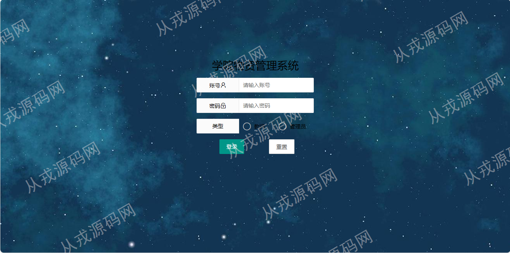

<h1 align="center">73.学院物资管理系统</h1>

 获取sql文件 QQ: 386869957 QQ群: 377586148 

 [推荐站点: 从戎源码网](https://armycodes.com/) 

## 简介

> 本代码来源于网络,仅供学习参考使用!
>
> 提供1.远程部署/2.修改代码/3.设计文档指导/4.框架代码讲解等服务
> 
> 登录地址：http://localhost:8080/loginPage
> 
> 管理员：admin 123456
> 
> 教师：001 123456
>

## 项目介绍
基于springboot的学院物资管理系统：前端thymeleaf、jquery、layui，后端 maven、springmvc、spring、mybatis，有配套报告文档，集成物资购买管理、物资出入库管理、物资领取、统计查询等功能于一体的系统。

## 功能介绍

### 管理员

- 物资购买管理：物资信息增删改查，多条件查询，物资类型分为固定资产、消耗品、福利物品
- 物资出入库管理：入库列表，新增入库操作，多条件查询，物资发放，出库列表
- 物资库存信息：库存信息列表，按物资名称查询
- 物资领取记录：领取记录列表，多条件查询
- 统计查询：入库统计，出库统计，饼图显示
- 教师管理：教师信息的增删改查
- 权限管理：权限信息的增删改查，权限对应操作表单配置
- 菜单管理：菜单信息的增删改查，左侧树形列表
- 用户管理：用户信息的增删改查，设置密码用于登录系统

### 教师

- 物资列表：物资列表，物资领取操作，条件查询
- 我的领取记录：领取记录列表，条件查询，仅限自己是领取记录可查询

## 环境

- <b>IntelliJ IDEA 2021.3</b>

- <b>Mysql 5.7.26</b>

- <b>JDK 1.8</b>

## 运行截图

